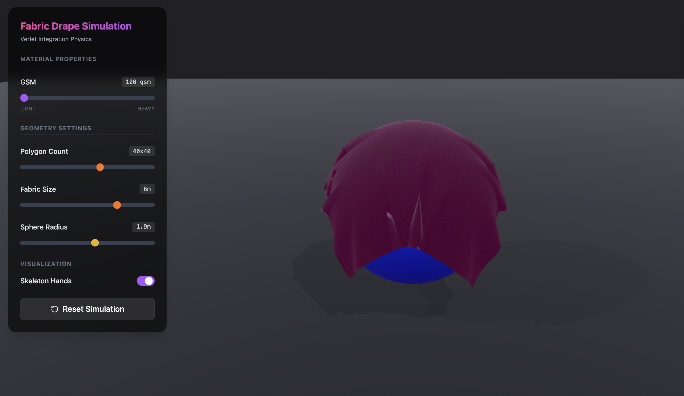

## FabricDraper

Interactive fabric drape simulation built with React, React Three Fiber, and MediaPipe Hands. Use your real hands (via the webcam) to grab and drape a virtual cloth over a sphere and explore different fabric behaviors.



---

### Features

- Real‑time cloth simulation using Verlet integration
- Hand tracking with MediaPipe Hands
- Pinch‑to‑grab cloth corners and move them with your hands
- GSM‑style slider to control fabric stiffness
- Adjustable cloth size and sphere radius
- Rough, low‑shine fabric material with procedural texture
- Optional skeleton hand visualization and camera preview toggle

### Tech Stack

- React + TypeScript
- Vite
- React Three Fiber / Three.js
- @react-three/drei
- MediaPipe Hands (@mediapipe/hands, @mediapipe/camera_utils)

### Getting Started

1. Install dependencies:

   ```bash
   npm install
   ```

2. Run the development server:

   ```bash
   npm run dev
   ```

3. Open the URL printed in the terminal (usually http://localhost:5173) and allow camera access when prompted.

### Basic Controls

- **Camera**: Orbit with right mouse button, scroll to zoom
- **Fabric stiffness**: Adjust the GSM slider in the left control panel
- **Cloth & sphere size**: Use "Fabric Size" and "Sphere Radius" sliders
- **Hand interaction**:
  - Enable camera preview (top‑right card)
  - Bring your hands into view and pinch thumb + index to grab cloth corners
- **Skeleton hands**: Toggle on/off in the "Visualization" section
- **Reset**: Use the "Reset Simulation" button in the control panel

### Build for Production

```bash
npm run build
```

The built assets will be in the `dist` folder and can be deployed to any static host (e.g., GitHub Pages, Vercel, Netlify).

# FabricDraper
